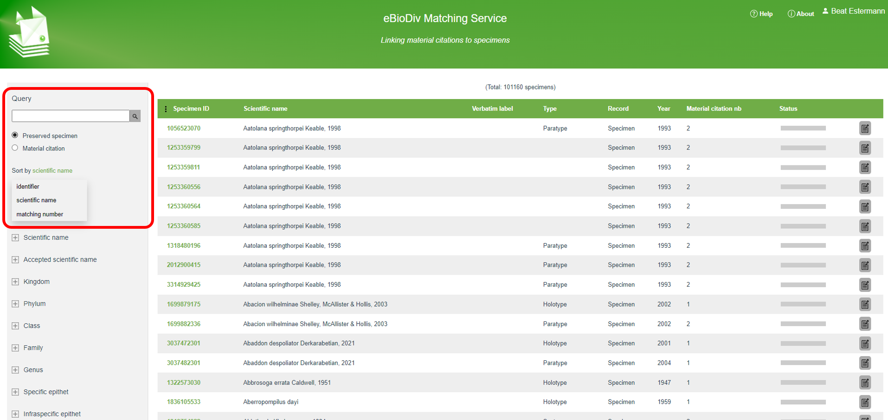
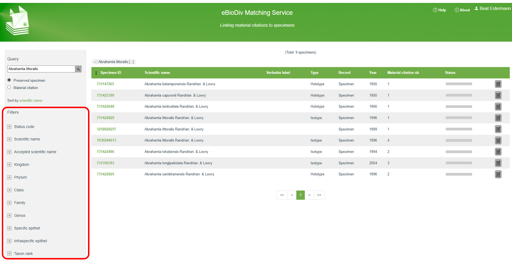
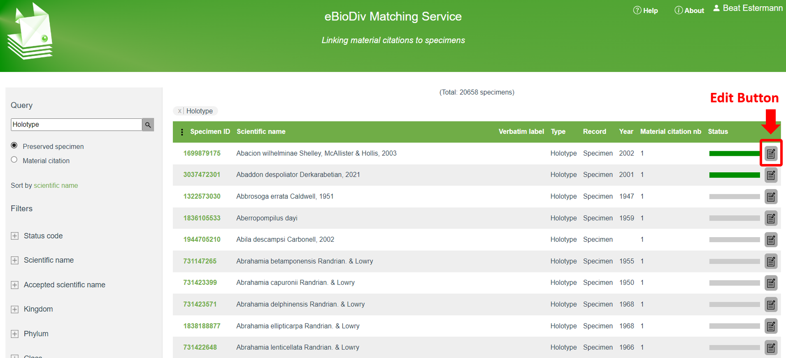
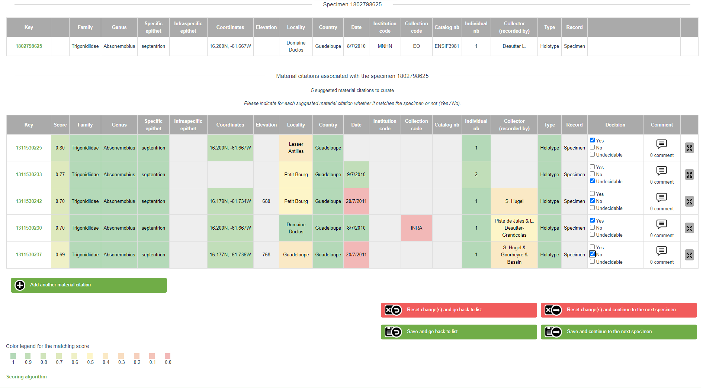
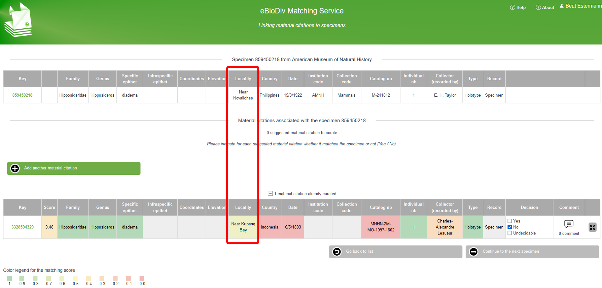

# Introduction to the matching service

The Earth’s scholarly knowledge about species diversity (biodiversity) is included in a corpus of several hundred million pages of academic publications spanning over 250 years, with an arbitrary starting point of 1753 for plants and 1758 for animals. These publications often contain references to biological specimens in natural history collections. In a digital world, access to this trove of biodiversity knowledge would be greatly enhanced if the references between the scholarly articles and the cited specimens were bidirectional and machine readable.

The **eBioDiv Matching Service** helps bridge this gap: The crowdsourcing tool allows users to match material citations contained in the academic literature to the respective specimens in natural history collections. To facilitate the task, a semi-automatic matching approach is used, where users are presented with lists of possible matches, along with matching scores indicating the probability of a match calculated by an [algorithm](matching_algorithm.md) developed for this purpose. Over time, the matching decisions taken by the users will be used as input to further refine the algorithm, thus increasing the efficiency of the tool.

!!! warning Disclaimer
    Note that the eBioDiv Matching Service and its documentation are still under development and are continuously updated; it may therefore well be that you will encounter some minor discrepancies between the text or the illustrations in this help section and the tool itself.

## Getting Started

To get started, click on the “Login” button in the top right corner to log in with your ORCID iD. If you do not have an ORCID iD yet, create one by registering [here](https://orcid.org/register).

By default, the start screen of the eBioDiv Matching Service features a list of all the **specimens** that can be matched, ordered by their Specimen ID. The list contains specimens for which [data has been made available](data.md) on [GBIF.org](https://www.gbif.org/) and for which potentially corresponding material citations have been found in [scientific publications made available](data.md) through the [Plazi Treatment Bank](http://plazi.org/treatmentbank/).

In the top left corner (marked in red in the screenshot below), you can toggle the view to get a list of all the **material citations** instead. Note that the data is the same, but you can choose whether you would like to do the matching of the selected items starting from a list of specimens or starting from a list of material citations.

<figure markdown>
  
</figure>

By means of a drop down menu, you can sort the table on different variables, such as the scientific name or the number of potential matches, or you can restrict your selection by entering a search term in the “Query” area. 

Right below the “Query” area, you have a series of filters at your disposal (marked in red in the screenshot below), which provide you with additional possibilities to restrict your selection.

<figure markdown>
  
</figure>

These filters allow you to configure your selection according to your preferences: You could for example decide to work on entries pertaining to a specific taxon, related to a specific country, or to a particular institution; or you could restrict your selection to material citations in papers published by a specific author or in a particular journal. 

Once you have specified your selection, click on the edit button on the right-hand side of the first item in the table (see screenshot), in order to open up the matching screen.    

<figure markdown>
  
</figure>

Note that in the screenshot above, the status bar for the first two items is in dark green, which means that the matching for these items has already been done. Unless you want to review existing matching decisions, you may therefore go right away to the first item with incomplete matching decisions. In the given case, this would be item number three, where the gray status bar indicates that the given cluster has not yet been worked on. If you want to hide all the items with a given status (e.g. all the items that have already been completed), you can do so by means of the filter “Status code” on the left hand side of your screen.

## Matching Specimens with Material Citations
On the matching screen you are presented with the selected specimen (top row) and one or several material citations that are potentially matching the selected specimen.

*If you have chosen to do the matching starting from material citations instead of specimens, the top row will show a material citation instead of a specimen, and in the lower part you will be presented with a list of specimens that are potentially matching the selected material citation. The way the matching service works is the same, independently of whether you match items starting from a specimen or from a material citation.*

For each of the material citations presented in the list, decide whether it is matching the specimen indicated on the top and record your decision by selecting “Yes” (match), “No” (no match), or “Undecidable” (see screenshot). 

<figure markdown>
  
</figure>

The data entries for the material citations are color coded, depending on how well the values match the values of the specimen (dark green = “full match”; yellow = “partial match”; red = “no match”).

When you are done, hit one of the green **“Save …”** buttons at the bottom of the page. There are two options: You can either save your decisions and go back to the overview list, or you can save your decisions and continue directly to the next entry in the overview list. You do not need to enter a decision for every suggested match on the matching screen before saving. You can always save your decisions while leaving some of the proposed matches untouched. Furthermore, by clicking on one of the red buttons, you can navigate away from the given screen without saving anything.

There are three possible outcomes your matching decisions can take:

1. **The material citation refers to the specimen** (“**Yes**, it is a match.”)

    If a given “material citation”-”specimen” pair is a match, select “Yes”.

    In the case of a match, a large majority of values in the data fields concerning the material citation should be identical with the values for the given specimen (indicated by green coloring).
    Note, however, that some discrepancies may exist in the data (indicated in yellow, orange, or red): for example due to inconsistencies in the descriptions of locations or the representation of catalog numbers (see the screenshot above).    

1. **The material citation does not refer to the specimen** (“**No**, it is not a match.”)

    If a given “material citation”-”specimen” pair clearly is no match, select “No”.

    In the case of no match, several values in the data fields concerning the material citation are usually different from the values for the given specimen (indicated by red or orange coloring).
    Note, however, that certain overlaps in the data usually exist (indicated in dark green); otherwise, the given “material citation”-”specimen” pair would not have been suggested as a potential match in the first place (see: matching algorithm(matching_algorithm.md)). Also, some fields that refer to completely different things in reality may still show up in light green color due to apparent similarities in the data (in the example in the screenshot below, the locality indication contains in each case the word “Near”). 

    <figure markdown>
        
    </figure>

1. **It is unclear whether the material citation refers to the specimen** (“**Undecidable**”)

    If you think that the data is insufficient to decide whether a given “material citation”-”specimen” pair is a match, tick “Undecidable”. If you are completely unsure what to put, you may also tick none of the options and leave it undecided.

## Personalizing and Sharing your Matching Challenges

Note that your personalized view of the data is always reflected in the URL, which means that you can save your preferred views in your bookmarks to return to them later or to share them with your friends. Thus, by selecting your preferred views and by applying the right filters, you can specify matching challenges that are of particular interest to you, to your institution, or to your community, in order to work on them systematically, both individually or collectively.

As you work systematically on such challenges, the filter “Status code” (on the very top) will be useful to filter out potential matches that have already been worked on, or to spotlight those which have been found to be “undecidable” by yourself or by others, or to review the pairs that have already been matched.

