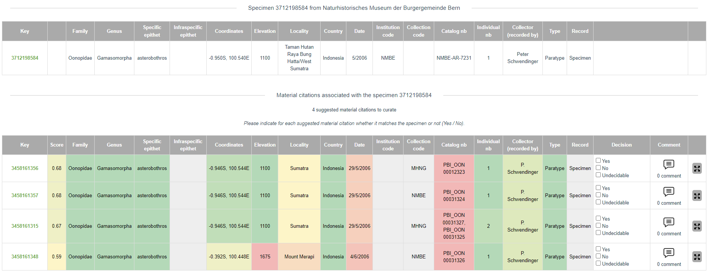

# Matching algorithm

The **eBioDiv Matching Service** uses a semi-automatic matching approach to match material citations and specimens. This means that users of the matching service are presented with a set of suggested matches, based on prior evaluation of the data by a computational approach. This computational evaluation of the data happens in two steps:

**Step 1: Data clustering by GBIF**

In 2020, the [Global Biodiversity Information Facility (GBIF)](https://www.gbif.org/) introduced a data clustering feature that identifies potentially related records by matching similar entries in individual fields across different datasets that have been published through the GBIF platform. To learn more about the clustering algorithm used by GBIF, please refer to this [blog post](https://data-blog.gbif.org/post/clustering-occurrences/) describing how GBIF identifies potentially related records in their database. The source code of the clustering algorithms is available on Github: [OccurrenceRelationships.java](https://github.com/gbif/pipelines/blob/dev/sdks/core/src/main/java/org/gbif/pipelines/core/parsers/clustering/OccurrenceRelationships.java#L26), [Cluster.scala](https://github.com/gbif/pipelines/blob/dev/gbif/ingestion/clustering-gbif/src/main/scala/org/gbif/pipelines/clustering/Cluster.scala).

Clusters including material citations published by Plazi are selected and serve as the basis for the matching service. Currently, these are dumps on demand, the goal being to automate these exports routinely in the future.

**Step 2: Evaluation of potential matches by the eBioDiv Matching Service**

The eBioDiv Matching Service uses the GBIF data clusters as a starting point to identify potential matches between material citations contained in the academic literature and specimens in natural history collections. It then uses a further algorithm to evaluate these potential matches based on the data provided and to rank them in the order of likelihood that the assertion of a match is indeed true.

The table below gives an overview of how the algorithm applied by the eBioDiv Matching Service is processing the different data fields to calculate matching scores for each pair (material citation & potentially matching specimen). Thereby, matching scores are calculated for each data field, which then serve as inputs to calculate an overall aggregate matching score for the pair.

<figure markdown>
  
  <figcaption></figcaption>
</figure>

The results of this computational evaluation of the potential matches between material citations and specimens contained in the GBIF database are then presented to the users of the eBioDiv Matching Service. As can be seen in the screenshot below, the matching scores of individual fields are indicated by means of a color code ranging from red (no match) to green (match), while the aggregate matching score for a given pair is provided in the second column (“Score”). Results are presented in the order of likelihood that the assertion of a match is true.

Users of the eBioDiv Matching Service are then asked to review the potential matches by indicating whether the assertion of a match is indeed true (“**Yes**, it is a match”), false (“**No**, it is not a match”), or whether no decision can be based on the data at hand (“**Undecidable**”). This matching information is then written back to the system, with some of the suggested matches being confirmed, and others being rejected or explicitly left undecided.    

## Known limitations and their implications

Given the current setup of the eBioDiv Matching Service, the following limitations apply:

### Data publication to GBIF as a prerequisite

The eBioDiv Matching Service can only be used to confirm / reject potential matches between material citations and specimens that previously have been published on GBIF. The standard approach to dealing with this limitation is to publish material citations and/or collection data that should be included in the eBioDiv Matching Service on the GBIF Platform (instructions how to do so, can be found [here](https://ebiodiv.org/help/data/)).

There is also a built-in workaround in the eBioDiv Matching Service that lets users manually enter further material citations or specimens using their respective persistent identifiers (e.g. CETAF PID).

### Reliance on preliminary data clustering by GBIF

The eBioDiv Matching Service relies on the data clusters provided by GBIF. Users of the eBioDiv Matching Service are always presented with GBIF clusters: There are different ways to access clusters that are of particular interest to a user, and the user is given the possibility to switch between a specimen-centered view and a material-citation-centered view of the clusters they are looking at. There is however no going beyond GBIF’s data clustering feature, which is used to pre-select potentially matching entries in the first place.

### Data quality and completeness

Both the clustering algorithm used by GBIF and the matching algorithm used by the eBioDiv Matching Service rely on the quality and the completeness of the data published on GBIF. 

As regards the specimen metadata, this data is usually provided by the curators of the natural history collection in question. Its quality and completeness depend on many factors along the data value chain, starting from the collectors and their habits of recording information, reaching to the various curators and the data management practices in place at the given institution over time, through to the emerging data management practices among the natural heritage community as it has started to embrace digitization.

As regards the quality and completeness of the material citations, we are facing a similar situation: As the data is extracted from scientific journals using computational means, the quality and completeness of the data is first and foremost reliant on the citation practices observed by the various authors and facilitated or imposed by the journal editors and publishers. While the omission of repetitive data or of information that can be inferred from the given context might be a virtue in a paper-based world where human experts are the only target audience, it is a major challenge when it comes to extracting data from journals by means of computer algorithms. The large variety of editorial conventions and practices adds a further layer of complexity.

Four distinct approaches are currently pursued to mitigate the challenges related to data quality and completeness:

1. Improving the quality and completeness of legacy data, in cooperation with curators of natural history collections. 

2. Improving the quality and completeness of the data extracted from scientific journals by further improving the algorithms employed.

3. Providing access to the source material and the original context of the data directly from the user interface of the eBioDiv Matching Service in order to facilitate the human evaluation process by users of the service.

4. Working towards improving and harmonizing data management practices within the natural history community (focusing both on collections and publications), making the eBioDiv Matching Service redundant over time, as newly generated references, including the links between material citations and specimens are machine-readable from the outset. 

## Perspectives of further improvement of the algorithm

Further improvement of the algorithm is taking place along the following lines:

### Incremental improvements to the eBioDiv matching algorithm
 
There are still some minor inconsistencies in how the matching algorithm of the eBioDiv Matching Service calculates the matching scores and in the way the results are presented to the users. These issues can be resolved over time by directly improving the matching algorithm; in some cases, fixing inconsistencies in the data on the Plazi Treatment Bank might be the best way forward.

### Incremental improvements to the GBIF clustering algorithm

The matching decisions recorded by the users of the eBioDiv Matching Service are written to the Plazi Treatment Bank and from there published in the material citation as “reference”. It is currently examined how this information can be fed back to the GBIF platform, so that it can serve as an input to the GBIF clustering algorithm in the future. Over time, this will allow to gradually improve the clustering by building a human curation step into the process. 

### Gradual shift towards fully automatic matching

Once a sufficient number of matching decisions have been recorded by the users of the eBioDiv Matching Service, it will be possible to start exploring ways of gradually replacing the current semi-automatic matching approach by a fully-automatic matching algorithm for data pairs with a sufficient number of data points of score high enough to warrant automatic acceptance of a match. 

Furthermore, it might become possible to automatically sort out data entries that are clearly deficient and therefore unfit as an input for matching decisions. These data entries could then be relegated back to the maintainers of the data along with a request to improve the data.

As a result, fewer matching suggestions will have to be curated by humans. It will be interesting to observe how the intellectual work carried out by the users of the eBioDiv Matching Service will evolve over time as a result of this shift in the balance between the tasks relegated to computer algorithms and the tasks remaining with human contributors.

<!--
<iframe src="https://staging.ebiodiv.org/scoring" style="width:100%; height: 70rem; padding: 0; border: none">
-->
