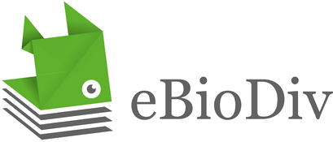
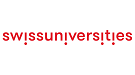
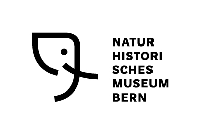

---
hide:
  - navigation
  - toc
---

<h1> Literature services for BioDiversity</h1>

## Purpose

The proposed e-BiodDiv can be defined like open biodiversity FAIR-ification services for biospecimens stored in Swiss natural history museums. It will on the one hand provide **a service for Swiss biodiversity scientists to access and disseminate their research data about species** in legacy and prospective publications, provide access to data about their collections, scientists and specimens. It will complement the recently funded SwissBioCollection program and genomic data. On the other hand, **importing treatments into the Swiss Institute of Bioinformatics Literature Services** ([SIBiLS]) opens them for text and data mining through SIBiLS dedicated tools, and by the life science community.

<figure markdown>
  
  <figcaption>Interactions between institutions in eBioDiv</figcaption>
</figure>

To a large extent, the eBioDiv service is based on existing services such as the Biodiversity Literature Repository (BLR), Plazi TreatmentBank (TB), and Zenodo. The long term goal is to integrate this service in the portfolio of SIBiLS linking the biodiversity research data infrastructure in Switzerland. This project will complement and make use of the Horizon 2020 funded research infrastructure ([BiCIKL] development by providing the specific annotation services for the Swiss based scientists, and make a production level import of taxonomic treatments into SIBiLS.

## Data

The Earth’s scholarly knowledge about species diversity (biodiversity) is included in a corpus of **several hundred million pages of publications spanning over 250 years** , with an arbitrary starting point of 1,753 for plants and 1,758 for animals. Each year an estimated 19,000 animal and plant species and a multiple of augmentations of data are added to the already approximately known 1.9M species.

The data about each species are included in highly structured taxonomic treatments and figures. Increasingly these treatments include implicit links to the data used to describe and augment it, such as omic and digitized specimen data produced by SwissBioCollection. Because of its structure, this data can be extracted automatically to a high degree, bidirectionally linked from the literature to the cited resources and vice versa, made FAIR, and immediately reused by data aggregators such as GBIF and other researchers.

## Collaborative work

In addition to Patrick Ruch’s team at HES-SO and SIB ([Swiss Institute of Bioinformatics]) and Beat Esterman’s team at BFH, the project is built on the direct contribution of [Plazi] and the Natural History Museum of Bern ([NMBE]). The Swiss-based BLR and TB are the world’s leading services of liberating biodiversity data imprisoned in PDFs (portable document format) and a major contributor to the Global Biodiversity Information Facility ([GBIF]) where the FAIR data is reused.

Starting date: September, 1st 2021.

Ending date: August, 31st 2023.

Status: In progress. 

## Partners

<ul class="partners">
  <li itemscope itemtype="https://schema.org/Organization">
    <a href="https://www.hes-so.ch/en/homepage" target="_blank" itemprop="url">
      HES-SO
        
    </a>
  </li>
  <li itemscope itemtype="https://schema.org/Organization">
    <a href="https://plazi.org/" target="_blank" itemprop="url">
      Plazi
        
    </a>
  </li>
  <li itemscope itemtype="https://schema.org/Organization">
    <a href="https://www.swissuniversities.ch/" target="_blank" itemprop="url">
      swissuniversities
        
    </a>
  </li>
  <li itemscope itemtype="https://schema.org/Organization">
    <a href="https://sib.swiss/" target="_blank" itemprop="url">
      SIB
        
    </a>
  </li>
  <li itemscope itemtype="https://schema.org/Organization">
    <a href="https://bfh.ch/en/" target="_blank" itemprop="url">
      Bern University of Applied Sciences
        
    </a>
  </li>
  <li itemscope itemtype="https://schema.org/Organization">
    <a href="https://gbif.org/" target="_blank" itemprop="url">
      GBIF
        
    </a>
  </li>
  <li itemscope itemtype="https://schema.org/Organization">
    <a href="https://www.nmbe.ch/en" target="_blank" itemprop="url">
      Natural History Museum of Bern
        
    </a>
  </li>		
</ul>

---

		

		
DOIs lists are licensed under a <a rel="license" href="http://creativecommons.org/licenses/by/3.0/ch/" target="_blank">Creative Commons Attribution 3.0 Switzerland License</a>.

[SIBiLS]: https://candy.hesge.ch/SIBiLS/
[BiCIKL]: https://bicikl-project.eu/
[Swiss Institute of Bioinformatics]: https://www.sib.swiss/patrick-ruch-group
[Plazi]: https://plazi.org/
[NMBE]: https://nmbe.ch/en
[GBIF]: https://www.gbif.org/
