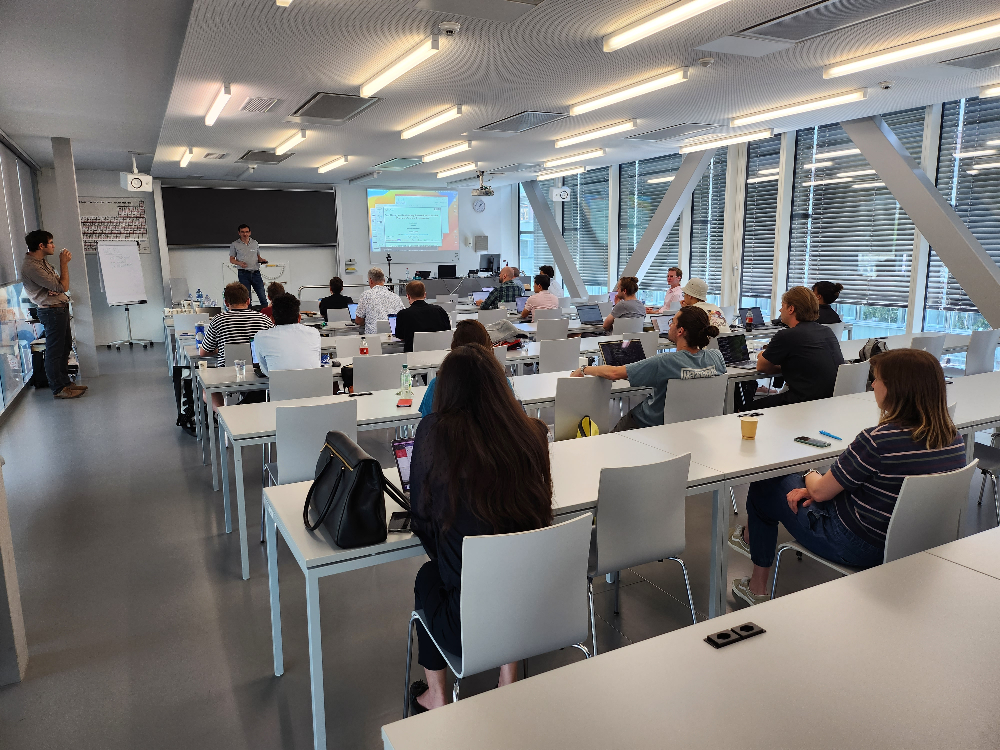

# Latest News

## Discussion with CETAF Publisher group at HEG Geneve

**Date:** Sept 14-15, 2023
**Location:** Geneva, Switzerland

<ins>People</ins>:  

 Patrick Ruch | Alexandre Flament | Emilie Pasche | Donat Agosti | Julien Gobeill | Déborah Caucheteur | Laurence Bénichou | Marianne Salaün | Lyubomir Penev | Laura Tilley
  

<ins>Goal</ins>:  

 Prepare a physical workshop to discuss why and demonstrate how to publish semantically enhanced, linked biodiversity publications.  

---

## Workshop Text Mining and Biodiversity Research Infrastructure

**Date:** June 12, 2023
**Location:** Neuchâtel, Switzerland

<ins>Scientific committee</ins>:  

Donat Agosti, Plazi | Pierre-Marie Allard, UNIFR | Nadir Alvarez | Laurence Bénichou | Fabio Rinaldi | Patrick Ruch | Robert Waterhouse

<ins>Topic</ins>:  

 Discussion about BiodiversityPMC (built and maintained by SIBiLS, Zenodo and Plazi), an equivalent of the PMC/PubMed for publications in the biodiversity domain which will provide an improved accesion of scientific knowledge on biodiversity to better understand the dynamics and dimensions of the global biodiversity crisis, the impact of climate change on the distribution of species and the viral spillover from animals to humans.

[Link to the Workshop Swiss-Text webpage](https://biodiversity.text-analytics.ch/)

---

## Presentation at Geneva Conservatory and Botanical Garden

**Date:** June  9th, 2023
**Location:** Geneva, Switzerland  

<ins>Topics</ins>:  

 The e-BioDiv matching engine has been demonstrated in front of about 50 registered participants from the Swiss museums and botanical gardens communities. We also introduced the readers into the upcoming Swiss Bio Data ecosystem (SBDe) and the connections between the e-BioDiv services and the SIB Literature Services (SIBiLS). We discussed how important data management is to properly turn collection data in FAIR Digital objects.
  

---
## Scientific Advisory Board meeting

**Date:** February 21st, 2023
**Location:** Online 

<ins>People</ins>:  

 Robert Waterhouse | Laurence Bénichou | Michelle Price | Elisa Herrmann | Dietrich Rebholz-Schuhmann | Patrick Ruch | Alexandre Flament | Emilie Pasche | Donat Agosti | Beat Estermann

<ins>Topics</ins>:  
- Discussions about:  
    &nbsp;&nbsp;&nbsp;&nbsp; - Communication   
    &nbsp;&nbsp;&nbsp;&nbsp; - Identifiers    
    &nbsp;&nbsp;&nbsp;&nbsp; - Material matching edge cases  
    &nbsp;&nbsp;&nbsp;&nbsp; - Training:  
        &nbsp;&nbsp;&nbsp;&nbsp;&nbsp;&nbsp;&nbsp;&nbsp;&nbsp;&nbsp;&nbsp;&nbsp; - target groups for the traning(s)  
        &nbsp;&nbsp;&nbsp;&nbsp;&nbsp;&nbsp;&nbsp;&nbsp;&nbsp;&nbsp;&nbsp;&nbsp; - training stakeholders  
    &nbsp;&nbsp;&nbsp;&nbsp; - Collaborations:  
        &nbsp;&nbsp;&nbsp;&nbsp;&nbsp;&nbsp;&nbsp;&nbsp;&nbsp;&nbsp;&nbsp;&nbsp; - NFDI4Biodiversity    
        &nbsp;&nbsp;&nbsp;&nbsp;&nbsp;&nbsp;&nbsp;&nbsp;&nbsp;&nbsp;&nbsp;&nbsp; - Biodiversity communites: World Spider Catalogue, WORMS, FishBase, ReptilBasem,  
        &nbsp;&nbsp;&nbsp;&nbsp;&nbsp;&nbsp;&nbsp;&nbsp;&nbsp;&nbsp;&nbsp;&nbsp; Mammals Data base, GBIF Nodes  
        &nbsp;&nbsp;&nbsp;&nbsp;&nbsp;&nbsp;&nbsp;&nbsp;&nbsp;&nbsp;&nbsp;&nbsp; - CETAF  
        &nbsp;&nbsp;&nbsp;&nbsp;&nbsp;&nbsp;&nbsp;&nbsp;&nbsp;&nbsp;&nbsp;&nbsp; - WHO's OneHealth  
        &nbsp;&nbsp;&nbsp;&nbsp;&nbsp;&nbsp;&nbsp;&nbsp;&nbsp;&nbsp;&nbsp;&nbsp; - Algae project at CJB Geneva  
    &nbsp;&nbsp;&nbsp;&nbsp; - RI landscape Europe  
    &nbsp;&nbsp;&nbsp;&nbsp; - Outreach:  
        &nbsp;&nbsp;&nbsp;&nbsp;&nbsp;&nbsp;&nbsp;&nbsp;&nbsp;&nbsp;&nbsp;&nbsp; - MusNatColl Metting (June 2023, Geneva)  

---

## Scientific Advisory Board meeting

**Date:** November 15, 2021
**Location:** Online

<ins>People</ins>:  

Laurence Benichou | Michelle Price (Geneva Botanical Gardens) | Elisa Hermann | Robert Waterhouse | Patrick Ruch | Donat Agosti | Déborah Caucheteur | Beat Estermann | Nadir Alvarez

<ins>Topics</ins>:  
- Bulding a corpus of journals covering Swiss natural history collections.  
- How involve amateur communities ?  
- Can eBioDiv literature be integrated into SwissCollNet ?  
- Need a discussion with publishers  
- How keep annotation longterm, not temporal ?  
- How to deal and link MfN backlog into eBioDiv ?  
- Definition of use cases (BiCIKL)  
- eBiodiv services:  
    &nbsp;&nbsp;&nbsp;&nbsp; S1. operational system to provide the world access to data in taxonomic publications  
    &nbsp;&nbsp;&nbsp;&nbsp; S2. workflow from the library to users providing access to FAIR data from within publications  
    &nbsp;&nbsp;&nbsp;&nbsp; S3. curation of data tagged in publications (QC)  
    &nbsp;&nbsp;&nbsp;&nbsp; S4. import of data to SIBiLS (treatment) and GBIF (article, treatment, material citation)  
    &nbsp;&nbsp;&nbsp;&nbsp; S5. Cross-references between literature and curated databases  
    &nbsp;&nbsp;&nbsp;&nbsp; S6. enable downstream support of a wide range of research use cases (e.g. biotic interactions)  
- Bidirectional linking between literature and GBIF:  
    &nbsp;&nbsp;&nbsp;&nbsp; S7 bidirectional linking of GBIF occurrence data with material citations from publications  
    &nbsp;&nbsp;&nbsp;&nbsp; S8. potential bidirectional links (automated process)  
    &nbsp;&nbsp;&nbsp;&nbsp; S9. curation of the links  

<ins>Conclusion</ins>:  

 The success of this project will depend on discussions with publishers, contact with SwissCollNet, discussion with the Swiss Natural History collection (SCNAT), discussion with other communities like librarians. In more technical aspects, it will be necessary to create a blue print on what will be done, illustrate usage to communities like Naturalis (Swiss Flora), define use case on how much the data in publications contributes to the awareness of specimen data in a publications, produce a metric on specimen usage and demonstrate the value of the data extracted and what new it provides. KPI definition to count citations of museums contents - and therefore journals - is important; by demonstrating to stakeholders that liberation of the data of their journals they can have access to new metrics valorising their collections they will understand that it is worth the effort.   

Key questions about the project:  

1. What are the key challenges to support biodiversity infrastructures ?  
    - taxonomic names
        - not solving a global problem
        - but solve it one journal by one journal
    - report on each journal what could be done better: start with a global guidelines and trying to encourage them to ask for the analysis.  

2. Which communities could benefit from eBioDiv beyond biodiversity communities ?  
    - the publishing community  

3. What could the museums infrastructures do better to facilitate eBioDiv ?  
    - better publishing  
    - better material citations  
    - use better ways to do better names publishing
---